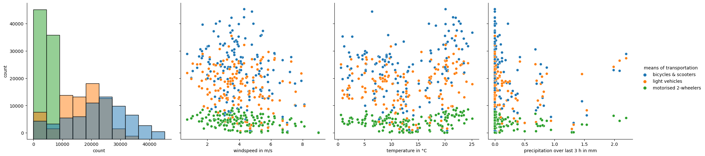

# How is the use of different means of transportation influenced by meteorological conditions?
### An investigation using data for the city of Paris
Question: is the choice of means of transportation (bicycle, motorised 2-wheeler, passenger car) influenced by meteorological conditions? Do people bike only on warm sunny days? Do they switch from their motorcycle to their car when it is raining?   
A short project done for a Coursera assignment.  

